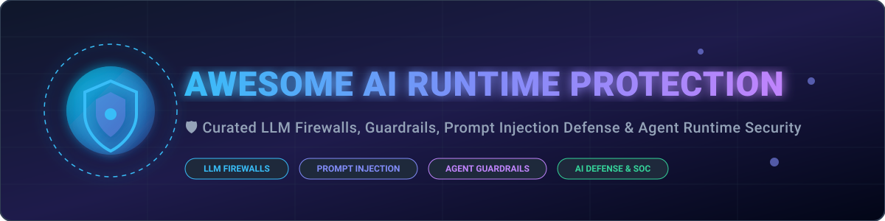

# 🛡️ Awesome AI Runtime Protection

  
  
  
  
  
  

## 🚀 Top AI Runtime Protection Ecosystem & Security Directory

**Curated List of Enterprise SaaS Platforms & Open-Source Security Tools**  

*Focused on LLM Firewalls, Prompt Injection Defense, Model & Agent Runtime Security, Guardrails, Adversarial ML Protection & AI Detection and Response (AIDR).*

---

### 📌 Overview & Market Context
This repository tracks notable **SaaS platforms** and **open-source projects** for **AI Runtime Protection**. These systems sit in front of or around models and agents to detect and block prompt injection, jailbreaks, data leakage, unsafe tool use, model abuse, and other runtime threats—functioning as LLM firewalls, guardrails, or AI detection-and-response layers.

- **Market Size & Growth**: The AI Runtime Security and LLM Firewall sector is estimated to reach **$3.5 Billion by 2028** (growing at a 38%+ CAGR), driven by enterprise adoption of autonomous GenAI agents and strict compliance requirements.
- **Market Dynamics**: The market is **moderately fragmented** but undergoing active consolidation (evidenced by Palo Alto Networks acquiring Protect AI, Check Point acquiring Lakera, and F5 acquiring CalypsoAI). While hyper-scale cloud providers and cybersecurity titans capture high enterprise market share, specialized open-source guardrail frameworks maintain dominant developer adoption.

---

## 📑 Table of Contents
- [🏢 SaaS/Hosted Platforms](#-saashosted-platforms)
- [🔓 Open-Source GitHub Projects](#-open-source-github-projects)
- [🤝 Support & Sponsorship](#-support--sponsorship)
- [📈 Star History](#-star-history)
- [🛠️ How to Contribute](#️-how-to-contribute)
- [⚠️ Disclaimer](#️-disclaimer)

---

## 🏢 SaaS/Hosted Platforms

| Product / Platform | Company Size / Valuation / Funding | Starting Pricing | Free Tier / Trial Limit | Description |
| :--- | :--- | :--- | :--- | :--- |
| **[NVIDIA AI Enterprise](https://www.nvidia.com/en-us/ai-data-science/products/ai-enterprise/)** | **$3.3 Trillion** Market Cap | $4,500 / GPU / year (or $1.00 / GPU / hr) | 90-day free trial (up to 8 GPU node licenses) | Enterprise AI software suite containing NeMo Guardrails and runtime control for policy-driven LLM applications. |
| **[Protect AI](https://protectai.com/)** (Palo Alto Networks) | **$650M - $700M** Acquisition (Parent market cap: ~$110B) | Enterprise custom / included in Prisma AIRS ($10,000/yr base package) | 30-day proof-of-concept / evaluation period | AI security platform for model supply-chain scanning, MLOps policy gates, and runtime guardrails. |
| **[Noma Security](https://noma.security/)** | **$400 Million** Valuation ($132M total funding) | Enterprise custom quote ($15,000/yr starting tier via marketplace) | 14-day proof-of-value environment (up to 5 models scanned) | Enterprise platform for AI application security, agent governance, and runtime asset discovery. |
| **[HiddenLayer](https://www.hiddenlayer.com/)** | **$380 Million+** Valuation ($155M total funding) | Enterprise custom quote ($20,000/yr starting tier via AWS Marketplace) | 14-day guided proof-of-concept demo environment | AI Security Platform offering model scanning, attack simulation, and AI Detection and Response (AIDR) runtime protection. |
| **[Lakera](https://www.lakera.ai/)** | **$300 Million** Acquisition by Check Point ($20M prior funding) | $0/mo (Community) / Enterprise starting at $500/mo | Free tier: 10,000 requests/month (Lakera Guard Community plan) | Developer and enterprise runtime guard focused on prompt injection defense and LLM safety filters. |
| **[Zenity](https://zenity.io/)** | **$185 Million** Total Funding ($125M Series C) | Enterprise custom quote ($12,000/yr starting tier) | 30-day trial & security assessment POC | AI application governance and agent runtime security platform monitoring shadow AI and tool execution. |
| **[CalypsoAI](https://calypsoai.com/)** (F5 Networks) | **$145 Million** Acquisition by F5 ($43.2M prior funding) | Enterprise contract via F5 ($10,000/yr base tier) | 14-day enterprise evaluation trial | AI security platform specializing in LLM red teaming, vulnerability testing, and enterprise proxy guardrails. |
| **[Fiddler AI](https://www.fiddler.ai/)** | **$99 Million** Total Funding ($30M Series C) | Developer tier starting at $0.002 per trace / Enterprise custom | Free tier: 10,000 traces/month ($0 forever plan) | ML observability & LLM monitoring platform providing real-time safety guardrails and model drift protection. |
| **[Arthur AI](https://www.arthur.ai/)** | **$65.7 Million** Total Funding ($42M Series B) | Premium tier starting at $60/month | Free tier: 4 use cases forever ($0/month plan) | Model monitoring and LLM runtime control platform featuring output validation and prompt injection defenses. |
| **[Aporia](https://www.aporia.com/)** (Coralogix) | **$30 Million** Prior Funding (Acquired by Coralogix) | Starter tier: $0 base / Scaler tier custom quote | Free tier: 14-day full access free trial (up to 50k predictions) | ML observability & AI guardrails engine offering real-time prompt injection blocking and system monitoring. |

---

## 🔓 Open-Source GitHub Projects

Sorted by GitHub Stars_Counts (descending):

| Project / Repository | GitHub_Stars | Focus / Primary Use Case | Description |
| :--- | :--- | :--- | :--- |
| **[NVIDIA garak](https://github.com/NVIDIA/garak)** |  | Automated LLM Vulnerability Scanner | Generative AI Red-teaming & Vulnerability Scanner for probing hallucination, jailbreaks, prompt injection, and data leakage. |
| **[Promptfoo](https://github.com/promptfoo/promptfoo)** |  | Red-teaming & Security CI/CD | CLI and library for evaluating LLM output quality, prompt injection resilience, security red-teaming, and regression testing. |
| **[Meta Llama Stack](https://github.com/meta-llama/llama-stack)** |  | Agent Guardrails & Alignment | Standardized building blocks and safety components (Llama Guard, Prompt Guard, CodeShield) for secure AI agent runtime environments. |
| **[Guardrails AI](https://github.com/guardrails-ai/guardrails)** |  | Input & Output Validation Rails | Open framework for adding structured validation, safety checks, and corrective actions around LLM outputs and inputs. |
| **[NVIDIA NeMo Guardrails](https://github.com/NVIDIA/NeMo-Guardrails)** |  | Programmable Policy & Dialog Rails | Leading open-source framework for adding programmable input, dialog, retrieval, execution, and output rails around LLMs and agents. |
| **[Protect AI LLM Guard](https://github.com/protectai/llm-guard)** |  | Input/Output Sanitization Toolkit | Open-source toolkit for scanning and sanitizing LLM inputs and outputs against prompt injection, PII, toxicity, and secrets. |
| **[Rebuff](https://github.com/protectai/rebuff)** |  | Multi-layered Prompt Injection Defense | Prompt injection detection framework using heuristic filtering, LLM detection, vector database canary tokens, and response validation. |
| **[AISafeGuard](https://github.com/akshaymagapu/aisafeguard)** |  | LLM Safety Proxy | Open LLM safety proxy providing prompt injection protection, PII redaction, toxicity filtering, and OpenAI API-compatible proxying. |

### 🛠️ Key Architectural Patterns in Open Source:
- **Programmable Policy Control**: [NeMo Guardrails](https://github.com/NVIDIA/NeMo-Guardrails) for dialog flow, grounding, and execution control.
- **Agent Egress & Alignment**: [Meta Llama Stack](https://github.com/meta-llama/llama-stack) for CodeShield execution safety and jailbreak defense.
- **Input/Output Scanning**: [LLM Guard](https://github.com/protectai/llm-guard) and [Guardrails AI](https://github.com/guardrails-ai/guardrails) for schema validation, PII masking, and payload filter checks.
- **Automated Red Teaming**: [garak](https://github.com/NVIDIA/garak) and [Promptfoo](https://github.com/promptfoo/promptfoo) for pre-deployment vulnerability testing in automated CI/CD pipelines.

---

## 💖 Support & Sponsorship

If you find this repository helpful in securing your AI models, LLM pipelines, or AI agents, please consider supporting the project! 🌟

- ⭐ **Star this repository** to help others discover it.
- 🔀 **Fork and contribute** new open-source tools or SaaS platforms.
- 📢 **Share with your team** and network on social media.
- ☕ **Buy me a coffee**: Support ongoing maintenance on GitHub Sponsors:

---

## 📈 Star History

---

## 🛠️ How to Contribute

1. Fork the repository.
2. Add/edit entries in `README.md` (following the existing table format).
3. Ensure entries include links, pricing/Stars_Badges, and factual descriptions.
4. Submit a Pull Request with a clear summary of your additions.

---

## ⚠️ Disclaimer

- This list is **community-curated** for research and educational purposes.
- AI runtime security is a rapidly evolving field. Prompt injection, jailbreaks, and agent tool abuse are active research topics—no guardrail provides 100% security guarantees. Combine runtime firewalls with least-privilege security architectures and human oversight.

---

  <b>Made for AI Security Engineers, ML SecOps Teams, and Builders of Safe AI Applications.</b>

